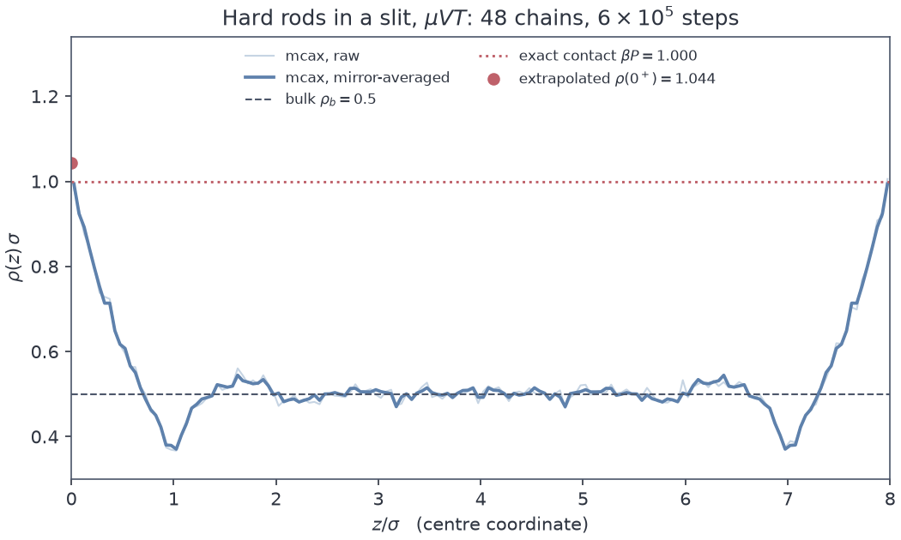

# mcax

Batched hard-particle **grand-canonical Monte Carlo in JAX**: hard rods, discs
and spheres in bulk and in slit confinement, many independent chains advanced in
lockstep on one device, everything jit and scan compiled.

Documentation and the longer argument: **https://pyatsysh.github.io/mcax/**

Hard cores mean there are no energies anywhere in the code. The Boltzmann factor
is an indicator function, so an overlap test plus three exact acceptances are the
whole of the physics, which is what keeps the engine small enough to audit line
by line.

## Why an accelerator changes Monte Carlo

A Markov chain cannot be parallelised inside itself: step `n+1` depends on step
`n`, and no hardware changes that. That is why Monte Carlo spent twenty years
watching molecular dynamics move onto GPUs without following.

The second axis was always there. Chains are independent of one another, so the
state becomes an array with a leading chain index, one `vmap` advances the whole
batch, and the sequential dependence stays along an axis nobody wanted to
parallelise. Two consequences are worth more than the speed: chain-to-chain
scatter is an honest independent-replica error bar, and because the chains really
are independent, adding chains buys effective sample size linearly, where extra
draws down a single chain buy nothing until that chain has mixed.

Compilation matters separately from the device. A Monte Carlo loop in NumPy
spends of order a microsecond per step inside the interpreter, more than the
arithmetic costs for a few hundred particles. `jit` and `lax.scan` remove that on
a laptop as much as on a GPU.

## What is on offer today

`jax-md` is JAX-native and excellent, but it is built for soft potentials and its
Monte Carlo is the hybrid swap kind aimed at glassy systems: hard cores in the
grand canonical ensemble are not its ensemble. HOOMD-blue HPMC is the reference
implementation of hard-particle Monte Carlo, faster per chain than anything here,
and a CUDA and C++ codebase that cannot be called from inside a training loop.
Writing your own takes an afternoon for the sampler and a month for the
validation, because the sampler is three acceptance ratios and knowing that they
are right is the actual work.

mcax fills the gap those three leave. It matters here because the consumers are
already JAX: the density-functional models, the training loops that fit them, and
the solvers underneath. A sampler in the same framework composes with them rather
than exporting to them, so grand-canonical ground truth can be generated inside a
training loop instead of shipped to it as a frozen dataset.

## Install

```bash
git clone https://github.com/pyatsysh/mcax && cd mcax
pip install -e ".[dev]"
```

Python 3.11 or newer, `jax` and `numpy`. Nothing else, and see
[Diagnostics](#diagnostics) for why that stays true. `float64` is not optional:

```python
import jax
jax.config.update("jax_enable_x64", True)
```

## Use

```python
import jax; jax.config.update("jax_enable_x64", True)
from mcax import make_spec, burn_and_sample, summary, format_summary, eos

# Hard spheres at bulk packing fraction eta = 0.3, in a slit 8 diameters wide.
rho_b = 0.3 / eos.B[3]
spec = make_spec(d = 3, H = 8.0, Lperp = 10.0, slit = True,
                 z_act = float(eos.z_of_rho(3, rho_b)))

res = burn_and_sample(spec, C = 64, seed = 0, n_burn = 200_000,
                      n_run = 1_000_000, thin = 500, nbins = 160)

print(format_summary(summary(res.Ns)))     # mixing, ESS, split R-hat
assert res.capacity_warning is None        # always check this
res.z, res.rho                             # the density profile
```

`burn_and_sample` returns a `Result`: the profile, the particle-number series
`Ns` shaped `(chains, draws)`, acceptance rates per move type, the capacity
diagnostics, and the final `state` so a run can be continued.

### Geometry and conventions

Five confinements, selected with `geom`:

| `geom` | what it is | `H` | `Lperp` |
|---|---|---|---|
| `bulk` | periodic everywhere | box edge | transverse edge |
| `slit` | hard walls on centres at 0 and `H` | wall separation | transverse edge |
| `sphere` | spherical pore, `d = 1, 2, 3` | **radius** | . |
| `cylinder` | cylindrical pore, `d >= 2` | axial period | **radius** |
| `wedge` | two walls meeting at `psi`, `d >= 2` | height above the apex | periodic edge |

`geometry.describe(spec)` prints that row back for a given spec, which is
quicker than counting axes. `slit = True/False` still selects `slit` or `bulk`.

Walls act on particle **centres** in every geometry, never on surfaces. That is
the centre-exclusion convention the DFT reference data uses, and it is what makes
the contact theorem `rho(0+) = beta P` apply literally rather than at a profile
shifted by `sigma/2`. Note the two places it does not apply: against a curved
wall, where curvature contributes at order `sigma/R`, and under an attractive
external field, where the general sum rule picks up an integral of
`rho grad V_ext`.

The density profile is binned along the wall axis in a slit or a wedge and along
the **radius** in a sphere or a cylinder, so `res.z` is a radius for the curved
pores and `res.rho` is normalised by that geometry's own shell volumes.

Lengths are in units of `sigma`, with `beta = 1` and `Lambda = 1`. Every energy
is therefore a `beta epsilon`, and temperature enters only through them.

### External fields and attractions

An external field and an attractive pair tail each multiply the acceptances by
the obvious Boltzmann factor and change nothing else:

```python
from mcax import fields, potentials

spec = make_spec(d = 3, H = 12.0, z_act = ...,
                 field = fields.both_walls(fields.LJ93Wall(eps = 1.2), 12.0),
                 pair  = potentials.SquareWell(eps = 1.0, lam = 1.5))
```

`mcax.fields` carries gravity, a harmonic trap, an isotropic trap, the 9-3
Lennard-Jones wall, a square-well wall and an exponential wall, with `Sum` and
`Mirror` to compose them. `mcax.potentials` carries the tails a mean-field
classical DFT actually models: a square well, a hard-core Yukawa, and
Lennard-Jones split by Weeks-Chandler-Andersen or by Barker-Henderson. Simulating
exactly the `w(r)` a functional assumes is the point: the discrepancy is then the
mean-field approximation itself and not a mismatch of Hamiltonians.
`potentials.mean_field_integral` gives the `int w d^d r` the functional consumes,
so both sides can be checked to be using the same number.

**mcax does not sample phase coexistence.** Below `T_c` the distribution of `N`
is bimodal with a barrier that grows with system size, and a plain muVT chain
does not cross it: it sticks in one phase and reports a converged-looking mean
that is wrong. Split R-hat does not reliably catch this either, because every
chain can stick in the same phase. There is no reweighting or umbrella sampling
here. Stay supercritical or dilute, and watch the `N` histogram.

### The zero-dimensional limit

`d = 0` is not a fourth dimension, because there are no positions to sample. It
is a **cavity too small to hold two particles**, and it matters far more than
that sounds: fundamental measure theory is constructed so that dimensional
crossover reproduces it exactly, which is where the logarithm in the Rosenfeld
functional comes from. It is the sharpest of the dimensional reductions and the
one an approximate functional most often fails.

mcax reaches it through geometry. A spherical pore of radius below `sigma/2`
admits at most one centre in any dimension, since two centres inside it are at
most `2R` apart:

```python
spec = make_spec(d = 3, geom = "sphere", H = 0.4, z_act = 0.5, Nmax = 4)
geometry.is_zero_dimensional(spec)      # True
```

The whole system is two states, so everything about it is exact and lives in
`mcax.eos`:

```
eta_0d(z, V)  = z V / (1 + z V)        occupancy, saturating at 1 for any z
var_n_0d(eta) = eta (1 - eta)          Bernoulli, fixed entirely by the mean
f_ex_0d(eta)  = eta + (1 - eta) ln(1 - eta)
mu_ex_0d(eta) = -ln(1 - eta)
```

Measured at d = 3, R = 0.4, z = 0.5, where 48% of insertion proposals are
rejected on the geometry: exact occupancy 0.118198, measured 0.118207 +/-
0.000039 over 2.6e8 steps. The variance is the better test of the two, because a
mean could come out right for an engine that merely never inserted twice.

The name invites a wrong picture, so it is worth being explicit: the cavity is
not a point and it is not empty. It is an ordinary region with an ordinary
volume, and at activity `z` it is occupied a fraction `zV/(1+zV)` of the time.
What is zero-dimensional is the excess free energy, which forgets the cavity
entirely. Holding the occupancy at `eta = 1/2` and varying the cavity over a
factor of 27 in volume and over d = 1, 2, 3:

| cavity | V | mu_ex measured | exact |
|---|---|---|---|
| sphere d = 3, R = 0.20 | 0.0335 | +0.69533 | +0.69315 |
| sphere d = 3, R = 0.40 | 0.2681 | +0.69533 | +0.69315 |
| sphere d = 3, R = 0.49 | 0.4928 | +0.69533 | +0.69315 |
| sphere d = 2, R = 0.40 | 0.5027 | +0.69405 | +0.69315 |
| sphere d = 1, R = 0.40 | 0.8000 | +0.69369 | +0.69315 |
| slit d = 1, H = 0.90 | 0.9000 | +0.69369 | +0.69315 |

Every `ln V` cancels between the total and the ideal free energy, so only the
ideal part keeps the geometry. That is why the activity needed to reach
`eta = 1/2` differs as `1/V` while `mu_ex` does not move, and it is why a finite
ball is a faithful realisation of the limit rather than an approximation to it.

### Response functions

The sampler cannot be differentiated (see [below](#what-it-will-not-do)), but in
the grand ensemble a derivative with respect to `beta mu` **is** a covariance
with the particle number, which is exact rather than approximate:

```python
from mcax import observables

chi, err = observables.susceptibility(res.Ns)       # d<N>/d(beta mu) = Var(N)
kappa, _ = observables.compressibility(res.Ns)      # Var(N)/<N> = rho kT chi_T
z, dr, _ = observables.response_profile(spec, res)  # d rho(z)/d(beta mu)
r, g, _  = observables.pair_correlation(spec, res)  # needs nbins_g > 0, bulk only
```

These cost no extra sampling: they are estimators over draws already taken. The
identity that ties them together,

```
Var(N)/<N>  =  [d(beta P)/d(rho)]^-1  =  rho kT chi_T  =  S(0)  =  1 + rho int [g(r) - 1] dr
```

is the most useful check in the library, because one number is reachable four
ways and disagreement says which of them is wrong. `eos.compressibility(d, rho)`
gives the exact value, and error bars come from the scatter across chains, which
are independent by construction.

### The three moves

```
displacement : accept iff no overlap and inside the walls
insertion    : accept with min(1, z V / (N+1)) iff no overlap
deletion     : accept with min(1, N / (z V)),        z = exp(beta mu)
```

Every step all chains draw a move type, compute all three branches
vectorised-and-masked, and select. That throws away two branches out of three and
wastes about three times the arithmetic. It is still the right trade, because it
keeps the batch free of divergence, which is what lets one compiled kernel
advance every chain at once.

## Validation

`mcax.eos` carries the reference equations of state. They are both the validation
targets and the way a run is set up, since the sampler takes an activity while a
physicist thinks in packing fraction.

The one-dimensional case is kept deliberately, and it is the reason to believe
the other two. Tonks and Percus solved hard rods in closed form, so a
detailed-balance error or a factor of the volume in the wrong place fails against
an exact number rather than against another simulation carrying its own errors.
In two and three dimensions the best references available are accurate to about
0.1%, so a marginal disagreement there is ambiguous between our bug and the
reference equation. In one dimension it is a bug.

Switching an attraction on would normally cost that guarantee, since there is no
exact equation of state for an attractive fluid in three dimensions. It does not
have to. In one dimension a square well of range `lam <= 2` reaches only nearest
neighbours, because two particles that are not nearest neighbours are separated
by at least two hard cores, and the one-dimensional fluid with nearest-neighbour
interactions is exactly solvable by Takahashi's construction in the isobaric
ensemble. `eos.sw1d_state` carries it, and `eps = 0` collapses it onto Tonks,
which is the first thing the tests check. So `d = 1` remains a razor with
attraction present, and the attractive engine is checked against an exact number
rather than against somebody else's simulation.

There is a second exact target in an unlikely place. Near the apex of a wedge the
opening falls below `sigma`, and a channel narrower than `sigma` **is** a Tonks
gas: two centres in it come into contact when their axial separation reaches
`sigma`. So the line density there must equal the exact one-dimensional inversion
evaluated at the local activity `z w(z)`. Measured 0.264 against 0.263. It is an
asymptotic statement and the test says so: one bin further out, where the opening
has widened to `0.62 sigma`, it is 23% off, which is the `(w/sigma)^2` that the
quasi-one-dimensional reduction discards.

One table, one run, all nine cases on the same GPU on the same day.

| Case | Reference | Reference accuracy | Measured rel. error | split R-hat |
|---|---|---|---|---|
| d = 1 bulk, eta = 0.5 | Tonks and Percus | **exact** | 0.0021 | 1.001 |
| d = 2 bulk, eta = 0.4 | Henderson | 0.1% | 0.0005 | 1.005 |
| d = 3 bulk, eta = 0.3 | Carnahan and Starling | 0.1% | 0.0014 | 1.016 |
| d = 1 slit contact, eta = 0.5 | rho(0+) = beta P, exact Tonks | **exact** | 0.0435 | 1.000 |
| d = 1 bulk square well, beta eps = 0.5, lam = 1.5, rho = 0.30 | Takahashi | **exact** | 0.00002 | 1.000 |
| d = 1 bulk square well, beta eps = 1.0, lam = 1.5, rho = 0.30 | Takahashi | **exact** | 0.0011 | 1.000 |
| d = 1 bulk square well, beta eps = 1.0, lam = 1.5, rho = 0.45 | Takahashi | **exact** | 0.0002 | 1.000 |
| d = 1 bulk square well, beta eps = 1.5, lam = 1.8, rho = 0.25 | Takahashi | **exact** | 0.0007 | 1.000 |
| d = 1 slit contact, square well, rho = 0.35 | rho(0+) = beta P, exact Takahashi | **exact** | 0.0628 | 1.000 |

Measured on one GPU, 2026-08-01, reproduced by
`scripts/validate.py --attractive --markdown` in about 12 minutes.
The bulk cases use 16 chains and 2e5 steps, except d = 3 which needs 32 chains
and 2e6 to clear the mixing gate. The contact case extrapolates a quadratic
through the first three bins after mirror-averaging the two walls, and that
extrapolation amplifies bin noise to about 0.03 in absolute terms, so its gate
sits near four sigma rather than at the 5% a reader might expect: at this
statistics a 5% gate was a 43% chance of a spurious failure, and a gate that
false-fails on a coin flip trains everybody to ignore it.

Every case asserts split R-hat as well as the density, which is not decoration.
On the first full run the three-dimensional case matched Carnahan-Starling to
0.1% while its chains had not mixed at all, at R-hat 1.23: started empty at an
insertion acceptance near 1%, they spent the whole burn-in filling. The mean was
right for the wrong reason and only the mixing statistic noticed. Seating 90% of
the target occupancy on a lattice and melting it in the burn removes the
transient, which is what `lattice_fill` is for.

```bash
pytest                        # 102 fast tests, 103 s on CPU
pytest -m slow                # full EOS validation, minutes per case
python scripts/validate.py --dims 1     # watch the exact cases run
python examples/wall_profile.py         # the figure above
```

The slow tier is deselected by default so a bare `pytest` is a usable
pre-commit gate.

Alongside the statistics, the fast suite pins the invariants that catch sampler
bugs rather than confirm sampler statistics: no two live centres closer than
`sigma`, verified with a separate NumPy implementation of the boundary
conventions so a geometry error cannot hide behind itself; the ideal-gas limit
`rho = z` at vanishing core size, which tests the acceptances with the overlap
test removed from the picture entirely; accepted insertions balancing accepted
deletions at equilibrium; per-chain PRNG independence; and bit-exact
reproduction from a seed.



The last five rows are the attractive ones, and they are the reason `d = 1` was
worth keeping. Takahashi's solution is exact for `lam <= 2`, so those are checks
against a closed form and not against somebody else's simulation. All four bulk
cases land inside 0.1%. A sign error in the energy, a double count, or a failure
to exclude a particle from its own neighbour list would each move them by
percent-scale amounts.

The two contact rows are the loose ones, at 4.4% and 6.3% against a 12% gate,
and for the same reason in both cases: extrapolating a quadratic through three
bins down to `z = 0+` amplifies bin noise to about 0.03 absolute. That gate sits
near four sigma deliberately, because a nominally strict 5% gate on this
statistics was a 43% chance of a spurious failure.

Every `d = 1` row above is bit-identical to the same case run on CPU: same
seeds, same means, same ESS, same digits. That is worth more than it looks, since
it says the batching and the reductions are not quietly device-dependent.

The `d = 3` row is the one to read carefully. Its ESS is 1670 of 128000 draws,
because N in a dense three-dimensional fluid decorrelates over roughly 70 draws
and the insertion acceptance there is 0.8%. The density is right to 0.14% but it
is the least-converged number in the table, and its R-hat of 1.016 says so.

The rest of the `slow` tier is not tabulated: the compressibility identities in
all three dimensions, S(0) by both routes, the local response integrating back
to Var(N), a disc pore recovering bulk in its middle, and the bin-averaged
barometric law. All 17 cases pass (`pytest -m slow`, 74 minutes on CPU).

## Diagnostics

`mcax.diagnostics` gives split R-hat, ESS by Stan's estimator with Geyer
initial-positive-sequence truncation, and MCSE, in NumPy alone.

```python
from mcax import summary
summary(res.Ns)     # mean, sd, mcse, ess, split_rhat
```

The boundary is deliberate. The natural output of a batched sampler is a
`(chain, draw)` array, which is exactly what ArviZ and NumPyro consume, so mcax
produces that layout and stops there. With ArviZ installed,
`az.summary(az.convert_to_dataset(res.Ns[None]))` works on the same array.
Interop by data shape costs nothing, whereas depending on a
probabilistic-programming stack to compute forty lines of autocovariance would be
a poor trade for a library whose install is otherwise just JAX.

## Performance

The figure of merit is **chain-steps per second**, since a step advances all `C`
chains at once and quoting bare steps per second understates the throughput by a
factor of `C`. On the heaviest production shape (d = 3, H = 8, eta = 0.35,
`Nmax` about 1300, 64 chains) the GPU ran about **21 times** the CPU throughput.

```bash
JAX_PLATFORMS=cpu  python scripts/bench.py
JAX_PLATFORMS=cuda python scripts/bench.py
```

Chain count is the dial. The batch axis is what the accelerator is for, and below
about 16 chains a GPU sits mostly idle.

## What it will not do

Being written in JAX does not make this differentiable, and that is worth saying
before anything else, because the inference is natural and it is wrong.
Acceptance is a discrete accept or reject against a uniform draw, the hard-core
log-density is an indicator function with no gradient anywhere, and the
grand-canonical state space is trans-dimensional. `jax.grad` of a profile with
respect to `mu` or `sigma` is not unimplemented, it is undefined by this route.
Response functions come from fluctuation identities instead, where the derivative
with respect to `beta mu` is a sampled covariance, and that is the supported
answer. It is exact, not a fallback: see [Response functions](#response-functions).

- **Fixed capacity.** A chain holds at most `Nmax` particles, and an insertion
  into a full chain is rejected. That is not a Metropolis rejection: it truncates
  the ensemble and breaks detailed balance. Nothing in a profile would reveal it,
  so every `Result` carries `saturation` and a `capacity_warning` that fires at
  95%. Read it before believing a number.
- **The overlap test is O(N).** Each trial move is tested against every live
  particle, with no cell list, and the cost is set by `Nmax` rather than by the
  occupancy. Comfortable to a few hundred particles per chain, and the first
  thing that has to change for large boxes.
- **Per-chain speed is not competitive.** A good single-chain C code beats it.
  The win is in the batch and in living inside JAX.
- **No phase coexistence.** With an attraction switched on the muVT distribution
  of `N` is bimodal below `T_c` and this sampler will not cross the barrier. No
  reweighting, no umbrella sampling, no finite-size scaling.
- **Single-component.** No mixtures and no aspherical shapes. External fields and
  attractive pair tails are supported; a second species is not.

## Licence

Apache-2.0.
